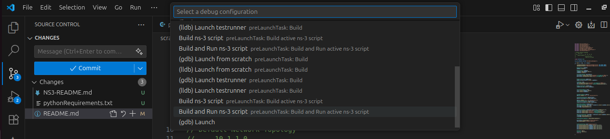

# NS3-Project

This repository contains NS-3 simulation scripts and a Python-based trace viewer for analyzing `.tr` files generated by NS-3. It includes `.cc` files for various network scenarios and a GUI tool for visualizing packet reception data.


##  Getting Started
To clone this repository:

```shell
git clone https://github.com/SatNaingTun/NS3-Project.git
```

## 🧠 Running NS-3 Simulations in Visual Studio Code (VSCode)

This project includes a `.vscode/` folder with configuration files that make it easy to build, run, and debug NS-3 `.cc` simulation files directly from VSCode.

### 📁 Included VSCode Configurations

- `c_cpp_properties.json` — sets up IntelliSense and include paths for NS-3 headers  
- `launch.json` — configures how to run or debug compiled NS-3 binaries  
- `tasks.json` — defines build tasks for compiling `.cc` files using NS-3  
- `.gitignore` — excludes build artifacts and temporary files from version control

---

### 🛠️ Prerequisites

Before using VSCode with NS-3:

1. Install [Visual Studio Code](https://code.visualstudio.com/)  
2. Install the **C/C++ extension** by Microsoft (search for `ms-vscode.cpptools` in Extensions)  
3. Clone and build NS-3 (recommended version: ns-3.39 or later)

---

### Step 1: Configure and Build NS-3

From your NS-3 root directory, run:

```shell
./ns3 configure --enable-examples --enable-tests
./ns3 build
```

### Step 2: Open the Project in VSCode

Open the NS3-Project folder in VSCode:

```shell
code /path/to/NS3-Project
```

###  Step 3: Use the Debug Configuration Dropdown

Visual Studio Code provides a convenient way to run and debug your NS-3 simulations using the debug configuration dropdown.

#### 📍 Steps:

1. Open your `.cc` simulation file in VSCode (e.g., `tcpbulk.cc`)
2. At the top of the VSCode window, locate the dropdown labeled:
3. Click the dropdown and choose one of the available options, such as:

- `Build ns-3 Script: prelaunchTask Build active ns-3 script`
- `Build and Run ns-3 Script: prelaunchTask Build and Run active ns-3 script`





> 💡 These options are defined in `.vscode/launch.json` and can be customized to match your simulation workflow, including arguments, environment variables, and debugger settings.

---

This method allows you to run NS-3 simulations with logging, tracing, or debugging tools — all from a single dropdown menu.


## 🐍 How to Run `traceApp.py`

The `traceApp.py` script provides a GUI-based NS-3 trace viewer for analyzing `.tr` files. It allows users to visualize packet reception, view summary statistics, and export results.

### 📦 Step 1: Install Python Dependencies

Make sure you have Python 3.7+ installed. Then, from the project directory:

```shell
pip install -r pythonRequirements.txt
```

## Acknowledgments

Some of the `.cc` files in this repository are based on or adapted from tutorials by Dr. Yerriswamy T, available on his YouTube playlist:

📺 [NS-3 Tutorials by Dr. Yerriswamy T](https://www.youtube.com/playlist?list=PLY_7h_846SGmOsy_5_wSeV4WMt9UNufyR)  
👨‍🏫 YouTube Channel: [@yerriswamy_bly](https://www.youtube.com/@yerriswamy_bly)

Special thanks to Dr. Yerriswamy for his clear and educational content on NS-3 simulation.

## 📘 NS-3 Reference Documentation

This project includes a dedicated NS-3 documentation file: [`NS3-README.md`](./NS3-README.md)

It provides:

- ✅ Setup instructions for NS-3  
- 🧪 Guidelines for running built-in examples and tests  
- 🔧 Notes on simulation configuration and environment setup  
- 📂 Directory structure and file organization tips  
- 📡 Usage of NS-3 modules and helper classes

> 📌 Use this file as your go-to reference for NS-3 fundamentals, especially when configuring simulations or troubleshooting build issues.

For advanced usage, visit the official NS-3 website: [https://www.nsnam.org](https://www.nsnam.org)