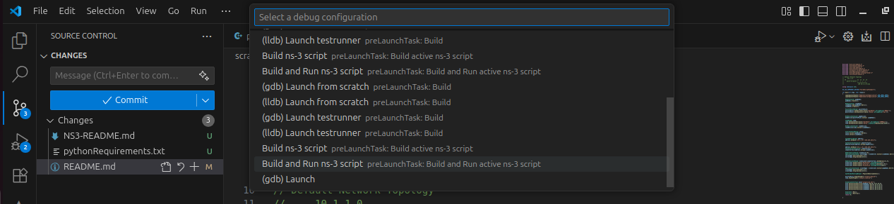

# NS3-Project

This repository contains NS-3 simulation scripts and a Python-based trace viewer for analyzing `.tr` files generated by NS-3. It includes `.cc` files for various network scenarios and a GUI tool for visualizing packet reception data.


##  Getting Started
To clone this repository:

```shell
git clone https://github.com/SatNaingTun/NS3-Project.git
```

## 🧠 Running NS-3 Simulations in Visual Studio Code (VSCode)

This project includes a `.vscode/` folder with configuration files that make it easy to build, run, and debug NS-3 `.cc` simulation files directly from VSCode.

### 📁 Included VSCode Configurations

- `c_cpp_properties.json` — sets up IntelliSense and include paths for NS-3 headers  
- `launch.json` — configures how to run or debug compiled NS-3 binaries  
- `tasks.json` — defines build tasks for compiling `.cc` files using NS-3  
- `.gitignore` — excludes build artifacts and temporary files from version control

### 📦 Package The Active Script As A `.deb`

This project also includes a packaging task for the active ns-3 script:

```shell
./scripts/build_ns3_source_deb.sh scratch/your-script.cc
```

To remove generated package artifacts for the active script:

```shell
./scripts/clean_ns3_source_deb.sh scratch/your-script.cc
```

To remove all generated package build folders and package outputs:

```shell
./scripts/clean_all_ns3_source_deb.sh
```

It creates a deb package under `dist/deb/` with:

- the active `.cc` file
- local source/header files included by that script
- a launcher named the same as the script
- Debian package dependencies such as `libns3-dev` and `pkg-config`

To let Debian/Ubuntu automatically download the required libraries from the
configured apt repositories, install the generated package with:

```shell
sudo apt install ./dist/deb/<script-name>_1.0.0_amd64.deb
```

Use `apt install`, not `dpkg -i`, if you want dependencies to be fetched automatically.

VS Code exposes both actions in the Run and Task menus:

- `Package active ns-3 script to deb`
- `Clean active ns-3 deb pkgbuild`
- `Clean all ns-3 deb pkgbuilds`

### WIFI Random `.deb` Guide

For the WiFi random simulation packaging workflow, see:
[`WIFI_RANDOM_DEB_GUIDE.md`](./WIFI_RANDOM_DEB_GUIDE.md)

---

## WiFi AI Dataset And Model Workflow

Use this workflow to generate NS-3 CSV outputs, combine them into a training
dataset, train the AI models, and compare model results.

### 1. Generate NS-3 CSV Outputs

First run the `wifi-random` simulation. It should create one group of files per
simulation run:

```text
wifi-random-...-seed10-perf.csv
wifi-random-...-seed10-nodedensity.csv
wifi-random-...-seed10-rssi.csv
wifi-random-...-seed10-modulation.csv
```

The dataset builder requires `*-perf.csv` and `*-nodedensity.csv`. The `rssi`
and `modulation` files may be generated by NS-3 but are not used by
`generate_training_dataset.py`.

Example:

```shell
wifi-random --outputDir="/media/sat-naing-tun/Data/test NS3/outputs/csv/wifi-random"
```

Run at least 3 simulation runs with different seeds so train/validation/test
splits can be created.

### 2. Combine And Split The Training Dataset

Run the dataset-only script:

```shell
/home/sat-naing-tun/Documents/NS3-Project/.venv/bin/python \
  /home/sat-naing-tun/Documents/NS3-Project/notebooks/generate_training_dataset.py \
  --source-dir "/media/sat-naing-tun/Data/test NS3/outputs/csv/wifi-random" \
  --out-csv "/media/sat-naing-tun/Data/test NS3/outputs/combine_analysis/final_training_dataset.csv" \
  --split-dir "/media/sat-naing-tun/Data/test NS3/outputs/datasets"
```

Quote paths that contain spaces, such as `test NS3`.

Default repo-local outputs are:

```text
outputs/combine_analysis/final_training_dataset.csv
outputs/datasets/train.csv
outputs/datasets/valid.csv
outputs/datasets/test.csv
```

The split is by unique `(RandSeed, RunDateTime)`, with the default ratio:

```text
train = 70%
valid = 15%
test  = 15%
```

### 3. Train Each Model

After `train.csv`, `valid.csv`, and `test.csv` exist, run the model training
notebooks:

```text
notebooks/training_LR_model_perSTA.ipynb
notebooks/training_RF_perSTA.ipynb
notebooks/training_XGBoost_perSTA.ipynb
notebooks/training_MLP_model.ipynb
notebooks/training_LSTM_model.ipynb
notebooks/training_GRU_model.ipynb
notebooks/training_BILSTM_model.ipynb
notebooks/training_CNN_LSTM_model.ipynb
notebooks/training_Transformer_model.ipynb
notebooks/training_GNN_model.ipynb
```

Note: `notebooks/generate_training_dataset.py` only creates datasets. The older
`notebooks/generate_dataset.py` also contains Linear Regression training code.

### 4. Evaluate And Compare Models

After model training, run:

```text
notebooks/models_comparison.ipynb
```

This notebook compares model prediction results, edge evaluation, and
computational evaluation.

Common troubleshooting:

- `Found 0 perf files`: `--source-dir` does not contain `*-perf.csv`.
- `Found 0 nodedensity files`: `--source-dir` does not contain `*-nodedensity.csv`.
- `No matching nodedensity`: a `perf` file has no matching seed/timestamp pair.
- `Need at least 3 simulation runs`: generate more NS-3 runs with different seeds.
- `unrecognized arguments: NS3/...`: quote every path containing spaces.

---

### 🛠️ Prerequisites

Before using VSCode with NS-3:

1. Install [Visual Studio Code](https://code.visualstudio.com/)  
2. Install the **C/C++ extension** by Microsoft (search for `ms-vscode.cpptools` in Extensions)  
3. Clone and build NS-3 (recommended version: ns-3.39 or later)

---

### Step 1: Configure and Build NS-3

From your NS-3 root directory, run:

```shell
./ns3 configure --enable-examples --enable-tests
./ns3 build
```

### Step 2: Open the Project in VSCode

Open the NS3-Project folder in VSCode:

```shell
code /path/to/NS3-Project
```

###  Step 3: Use the Debug Configuration Dropdown

Visual Studio Code provides a convenient way to run and debug your NS-3 simulations using the debug configuration dropdown.

#### 📍 Steps:

1. Open your `.cc` simulation file in VSCode (e.g., `tcpbulk.cc`)
2. At the top of the VSCode window, locate the dropdown labeled:
3. Click the dropdown and choose one of the available options, such as:

- `Build ns-3 Script: prelaunchTask Build active ns-3 script`
- `Build and Run ns-3 Script: prelaunchTask Build and Run active ns-3 script`





> 💡 These options are defined in `.vscode/launch.json` and can be customized to match your simulation workflow, including arguments, environment variables, and debugger settings.

---

This method allows you to run NS-3 simulations with logging, tracing, or debugging tools — all from a single dropdown menu.


## 🐍 How to Run `traceApp.py`

The `traceApp.py` script provides a GUI-based NS-3 trace viewer for analyzing `.tr` files. It allows users to visualize packet reception, view summary statistics, and export results.

### 📦 Step 1: Install Python Dependencies

Make sure you have Python 3.7+ installed. Then, from the project directory:

```shell
pip install -r pythonRequirements.txt
```

## Acknowledgments

Some of the `.cc` files in this repository are based on or adapted from tutorials by Dr. Yerriswamy T, available on his YouTube playlist:

📺 [NS-3 Tutorials by Dr. Yerriswamy T](https://www.youtube.com/playlist?list=PLY_7h_846SGmOsy_5_wSeV4WMt9UNufyR)  
👨‍🏫 YouTube Channel: [@yerriswamy_bly](https://www.youtube.com/@yerriswamy_bly)

Special thanks to Dr. Yerriswamy for his clear and educational content on NS-3 simulation.

## 📘 NS-3 Reference Documentation

This project includes a dedicated NS-3 documentation file: [`NS3-README.md`](./NS3-README.md)

It provides:

- ✅ Setup instructions for NS-3  
- 🧪 Guidelines for running built-in examples and tests  
- 🔧 Notes on simulation configuration and environment setup  
- 📂 Directory structure and file organization tips  
- 📡 Usage of NS-3 modules and helper classes

> 📌 Use this file as your go-to reference for NS-3 fundamentals, especially when configuring simulations or troubleshooting build issues.

For advanced usage, visit the official NS-3 website: [https://www.nsnam.org](https://www.nsnam.org)
