<style>
section {
  font-size: 24px;
  line-height: 1.28;
}
h1 {
  font-size: 42px;
}
h2 {
  font-size: 32px;
}
table {
  font-size: 19px;
}
code {
  font-size: 0.85em;
}
.small {
  font-size: 21px;
}
.compact {
  font-size: 20px;
}
.two {
  display: grid;
  grid-template-columns: 1fr 1fr;
  gap: 30px;
}
.image-pair {
  display: grid;
  grid-template-columns: 1fr 1fr;
  gap: 24px;
  align-items: center;
}
.image-pair figure {
  margin: 0;
  text-align: center;
}
.image-pair img {
  max-width: 100%;
  max-height: 430px;
  object-fit: contain;
}
.image-pair figcaption {
  margin-top: 8px;
  font-size: 20px;
  font-weight: 700;
}
</style>

# Model Architectures Explained

WiFi performance prediction models used in this project

**Targets:** Throughput, Latency, Loss  
**Input:** numeric simulation and per-STA features

---

# Common Training Setup

- One separate regressor is trained for each target:
  - `Perf_Avg_Throughput`
  - `Perf_Avg_Latency`
  - `Perf_Avg_Loss`
- Metadata columns are removed.
- Numeric feature columns are used as model input.
- Current training dataset has **73 input features**.
- Most neural models use mini-batches, Adam optimizer, and MSE loss.

**Defense point:**  
The comparison is fair because the same train/validation/test splits and target definitions are used across models.

---

# Input Shape

For tabular models:

```text
X = (samples, features)
```

For sequence neural models:

```text
X = (samples, sequence_length, features)
```

In the current notebooks, most sequence builders reshape each row into a **1-step sequence**:

```text
(N, 73) -> (N, 1, 73)
```

**Important interpretation:**  
Although LSTM, GRU, BiLSTM, CNN-LSTM, and Transformer are sequence-capable, the current notebooks mostly provide only one timestep per sample. Therefore, these models behave more like powerful nonlinear feature extractors than long-history temporal models.

---

# What The Models Predict

Each model predicts a scalar value:

```text
f(X) -> y
```

For each target, a separate model is trained:

| Target | Meaning |
|---|---|
| Throughput | average data delivery rate |
| Latency | average packet delay |
| Loss | average packet loss |

**Reason for separate models:**  
Throughput, latency, and loss have different scales and may depend on features in different ways.

---

# Model Overview

| Model | Main idea | Layers / structure | Uses convolution? |
|---|---:|---:|---:|
| Linear Regression | linear baseline | 1 linear output | No |
| Random Forest | bagged decision trees | 300 trees | No |
| XGBoost | boosted trees | 400 trees | No |
| MLP | dense neural network | 3 linear layers | No |
| LSTM | recurrent memory | 2 LSTM + 1 linear | No |
| GRU | lighter recurrent memory | 2 GRU + 1 linear | No |
| BiLSTM | forward + backward recurrence | 2 bidirectional LSTM + 1 linear | No |
| CNN-LSTM | local pattern extraction + memory | 1 Conv1D + 1 LSTM + 1 linear | Yes |
| Transformer | self-attention | embedding + 2 encoders + output | No |
| GNN | graph message passing | 2 GCNConv + 1 linear | Yes, graph convolution |

---

# Optimizer / Training Method

| Model | Optimizer or training method | Loss / objective |
|---|---|---|
| Linear Regression | closed-form least squares solver in `sklearn` | minimize squared error |
| Random Forest | greedy tree split optimization | reduce node impurity / variance |
| XGBoost | gradient boosting with shrinkage | regularized gradient-boosted regression loss |
| MLP | Adam, `lr=1e-3` | MSE loss |
| LSTM | Adam, `lr=1e-3` | MSE loss |
| GRU | Adam, `lr=1e-3` | MSE loss |
| BiLSTM | Adam, `lr=1e-3` | MSE loss |
| CNN-LSTM | Adam, `lr=1e-3` | MSE loss |
| Transformer | Adam, `lr=1e-4` | MSE loss |
| GNN | Adam, `lr=1e-3` | MSE loss |

---

# Optimizer: Defense Explanation

For neural models:

- Adam updates weights using adaptive learning rates.
- MSE loss is appropriate because the task is regression.
- Early stopping uses validation loss to reduce overfitting.

For non-neural models:

- Linear Regression does not use gradient-descent training in this notebook.
- Random Forest optimizes tree splits independently across many trees.
- XGBoost uses boosting: each new tree corrects previous prediction errors.

**Committee-safe answer:**  
Only the neural models use a conventional optimizer such as Adam. Tree and linear models use their own fitting algorithms.

---

# Architecture Images: LR and RF

<div class="image-pair">
  <figure>
    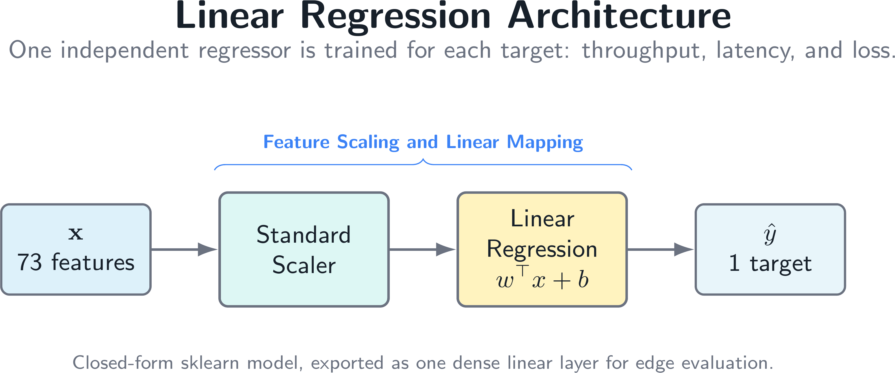
    <figcaption>Linear Regression</figcaption>
  </figure>
  <figure>
    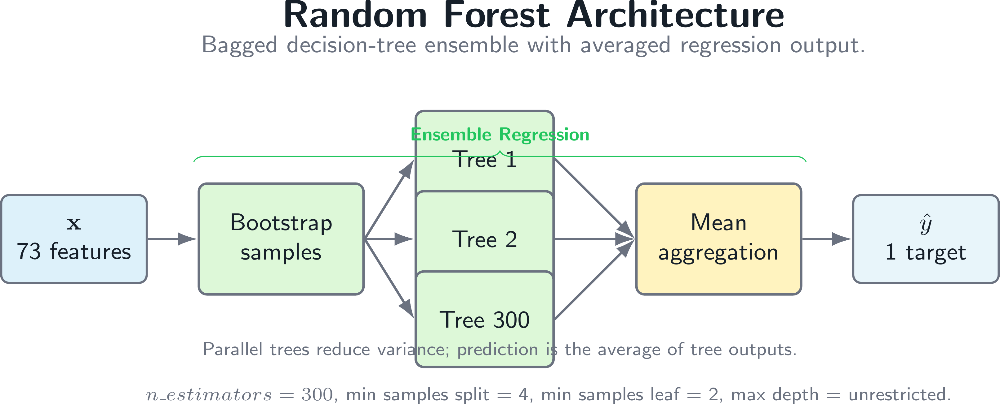
    <figcaption>Random Forest</figcaption>
  </figure>
</div>

---

# Architecture Images: XGBoost and MLP

<div class="image-pair">
  <figure>
    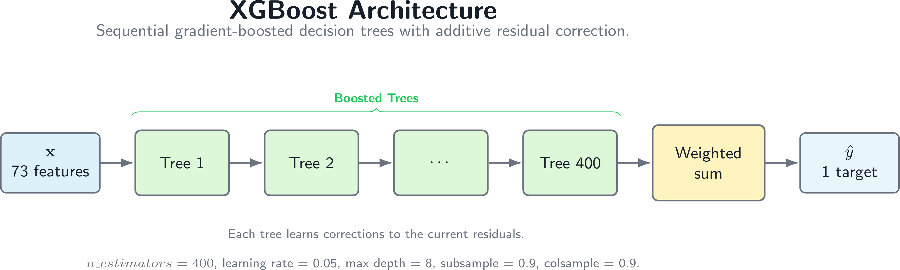
    <figcaption>XGBoost</figcaption>
  </figure>
  <figure>
    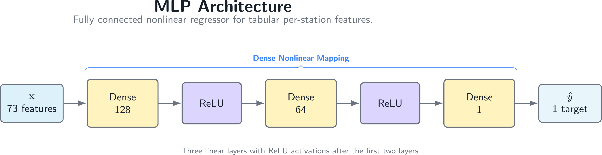
    <figcaption>MLP</figcaption>
  </figure>
</div>

---

# Architecture Images: LSTM and GRU

<div class="image-pair">
  <figure>
    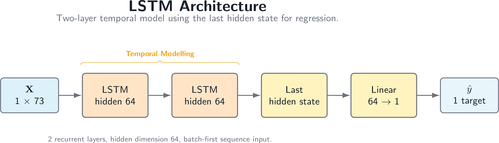
    <figcaption>LSTM</figcaption>
  </figure>
  <figure>
    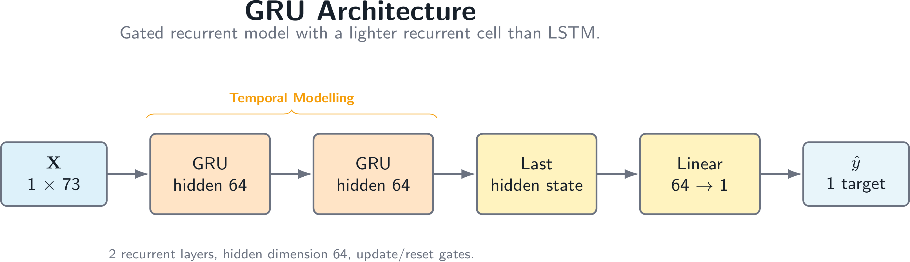
    <figcaption>GRU</figcaption>
  </figure>
</div>

---

# Architecture Images: BiLSTM and CNN-LSTM

<div class="image-pair">
  <figure>
    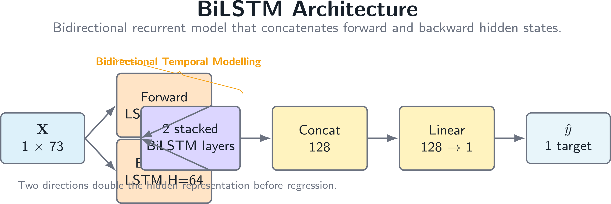
    <figcaption>BiLSTM</figcaption>
  </figure>
  <figure>
    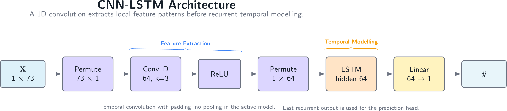
    <figcaption>CNN-LSTM</figcaption>
  </figure>
</div>

---

# Architecture Images: Transformer and GNN

<div class="image-pair">
  <figure>
    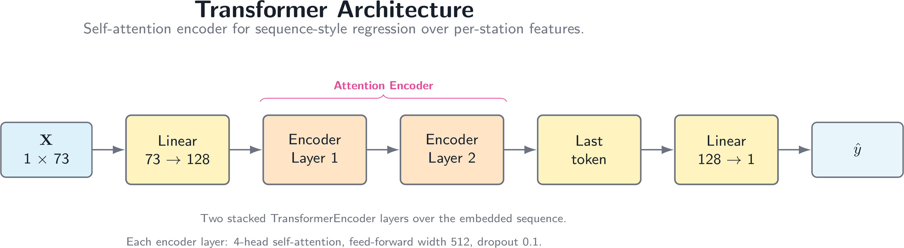
    <figcaption>Transformer</figcaption>
  </figure>
  <figure>
    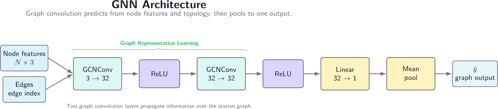
    <figcaption>GNN</figcaption>
  </figure>
</div>

---

# What "Layer Count" Means

- For neural networks, layer count refers to trainable transformation layers.
- Activations such as `ReLU` are not usually counted as trainable layers.
- For tree models, there are no neural layers.
- For RF and XGBoost, the comparable structure is number of trees and tree depth.
- For GNN, `GCNConv` is a graph convolution layer.
- For Transformer, each encoder layer internally contains attention, feed-forward layers, normalization, and dropout.

**Committee-safe answer:**  
Layer count depends on whether we count only top-level modules or all internal sublayers. In this deck, I report the top-level architecture used in the notebooks.

---

# Linear Regression

**Architecture**

```text
73 input features -> 1 output
```

- Layer count: **1 linear regression layer**
- Learns one weight per feature plus an intercept.
- Features are standardized with `StandardScaler`.
- It predicts by a weighted sum:

```text
y = w1*x1 + w2*x2 + ... + wn*xn + b
```

**How it works:**  
It assumes the target changes linearly with the input features.

---

# Linear Regression: Defense Details

**Strengths**

- Very interpretable baseline.
- Fast training and very low inference cost.
- Useful to test whether the dataset has a mostly linear relationship.

**Limitations**

- Cannot naturally model nonlinear feature interactions.
- Sensitive to feature scaling, so standardization is used.
- A single global linear equation may be too simple for WiFi behavior.

**Possible committee question:**  
Why include Linear Regression if it is simple?

**Answer:**  
It provides a baseline. If complex models cannot clearly outperform it, their extra cost is not justified.

---

# Random Forest

**Architecture**

```text
300 decision trees -> average prediction
```

- Layer count: not neural layers; it is an ensemble of **300 trees**.
- Notebook settings:
  - `n_estimators=300`
  - `max_depth=None`
  - `min_samples_split=4`
  - `min_samples_leaf=2`

**How it works:**  
Each tree learns feature split rules. The final prediction is the average of all tree outputs.

---

# Random Forest: Defense Details

**What each tree does**

- Splits the feature space using threshold rules.
- Example rule: `SNR_STA_3 <= value`.
- A leaf node stores the average target value of training samples reaching that leaf.

**Why averaging helps**

- Individual trees may overfit.
- Averaging many trees reduces variance.
- Random feature selection and bootstrapped samples create diversity among trees.

**Limitations**

- Less compact than a single model.
- Prediction must traverse many trees.
- Does not extrapolate well outside the training data range.

---

# XGBoost

**Architecture**

```text
400 boosted trees -> summed prediction
```

- Layer count: not neural layers; it is an ensemble of **400 boosted trees**.
- Notebook settings:
  - `n_estimators=400`
  - `learning_rate=0.05`
  - `max_depth=8`
  - `subsample=0.9`
  - `colsample_bytree=0.9`

**How it works:**  
Trees are added one by one. Each new tree tries to correct the errors left by previous trees.

---

# XGBoost: Defense Details

**Boosting idea**

```text
Prediction = tree_1 + tree_2 + ... + tree_400
```

- The first tree gives a rough prediction.
- The next tree learns the remaining error.
- Later trees refine the prediction gradually.
- `learning_rate=0.05` controls how much each tree contributes.

**Why it is often strong for tabular data**

- Handles nonlinear rules.
- Captures feature interactions.
- Regularization helps control overfitting.
- Works well when features are structured numeric columns.

---

# MLP

**Architecture**

```text
Input(73) -> Linear(128) -> ReLU
          -> Linear(64)  -> ReLU
          -> Linear(1)
```

- Layer count: **3 linear layers**
- Hidden layers: **128 neurons**, then **64 neurons**
- Output layer: **1 regression value**
- No convolution and no sequence memory.

**How it works:**  
The MLP learns nonlinear combinations of the input features through dense layers and ReLU activation.

---

# MLP: What Each Layer Does

```text
Linear(73, 128)
```

Expands the input into 128 learned feature combinations.

```text
ReLU
```

Adds nonlinearity and keeps positive activations.

```text
Linear(128, 64)
```

Compresses learned patterns into a smaller hidden representation.

```text
Linear(64, 1)
```

Maps the learned representation to one target value.

**Defense point:**  
MLP is a neural baseline for nonlinear tabular learning without assuming sequence or graph structure.

---

# LSTM

**Architecture**

```text
Input sequence -> LSTM(hidden=64, layers=2) -> Linear(1)
```

- Layer count: **2 stacked LSTM layers + 1 output layer**
- Hidden size: **64**
- Effective sequence length in the current training code: **1 step**
- Uses the last LSTM output for prediction.

**How it works:**  
LSTM uses input, forget, output, and candidate gates to decide what information to store, update, and expose.

---

# LSTM: Gate-Level Explanation

An LSTM cell maintains:

- hidden state `h_t`: short-term output representation
- cell state `c_t`: longer-term memory

Four gates are used:

| Gate | Role |
|---|---|
| input gate | decides what new information enters memory |
| forget gate | decides what old memory is removed |
| candidate state | proposes new content |
| output gate | decides what part of memory becomes output |

**Defense point:**  
LSTM is useful when past network states influence current performance. In the current code, this benefit is limited by the 1-step sequence.

---

# GRU

**Architecture**

```text
Input sequence -> GRU(hidden=64, layers=2) -> Linear(1)
```

- Layer count: **2 stacked GRU layers + 1 output layer**
- Hidden size: **64**
- Effective sequence length: **1 step**
- Uses the final timestep hidden representation.

**How it works:**  
GRU is similar to LSTM but simpler. It uses update and reset gates, so it usually has fewer parameters and faster inference.

---

# GRU: Why It Is Lighter Than LSTM

GRU has two main gates:

| Gate | Role |
|---|---|
| update gate | controls how much previous hidden state is kept |
| reset gate | controls how much previous state is ignored |

Compared with LSTM:

- no separate cell state
- fewer gates
- fewer parameters
- often faster inference

**Defense point:**  
GRU is included to test whether a simpler recurrent model can achieve similar accuracy with lower computational cost.

---

# BiLSTM

**Architecture**

```text
Input sequence -> Bidirectional LSTM(hidden=64, layers=2)
               -> Linear(128, 1)
```

- Layer count: **2 bidirectional LSTM layers + 1 output layer**
- Hidden size per direction: **64**
- Output to final layer: **2 x 64 = 128 features**
- Effective sequence length: **1 step**

**How it works:**  
It reads the sequence in both forward and backward directions, then combines both directions before regression.

---

# BiLSTM: Why Bidirectional?

Forward LSTM:

```text
t1 -> t2 -> t3
```

Backward LSTM:

```text
t3 -> t2 -> t1
```

The final representation combines both directions:

```text
64 forward hidden + 64 backward hidden = 128
```

**When it helps**

- When the full sequence is available before prediction.
- When future context in the window helps explain the current target.

**Limitation in this project**

- With a 1-step sequence, forward and backward context are almost the same.

---

# CNN-LSTM

**Architecture**

```text
Input: (batch, seq_len, features)
Permute: (batch, features, seq_len)
Conv1D(73 -> 64, kernel=3, padding=1) -> ReLU
Permute: (batch, seq_len, 64)
LSTM(hidden=64) -> Linear(1)
```

- Layer count: **1 Conv1D + 1 LSTM + 1 output layer**
- CNN channels: **64**
- LSTM hidden size: **64**
- Current effective sequence length: **1 step**

---

# How CNN-LSTM Uses Convolution

The convolution is:

```python
nn.Conv1d(
    in_channels=input_dim,
    out_channels=64,
    kernel_size=3,
    padding=1
)
```

- The model treats **features as input channels**.
- The convolution slides across the **temporal axis**.
- `kernel_size=3` means it can look at a local window of 3 timesteps.
- `padding=1` keeps the sequence length unchanged.
- The Conv1D output becomes the input sequence for the LSTM.

**Important:** because the current sequence length is 1, the convolution is structurally present but has limited temporal context.

---

# CNN-LSTM: Why Combine CNN and LSTM?

CNN part:

- extracts local temporal patterns
- transforms raw features into 64 learned channels
- works before the recurrent layer

LSTM part:

- reads the transformed sequence
- keeps a hidden state
- outputs the final sequence representation

Final linear layer:

- converts the LSTM representation into the predicted target

**Defense point:**  
CNN-LSTM is useful when short local changes occur before longer temporal dependency. In this dataset, longer temporal benefit requires sequence length greater than 1.

---

# CNN-LSTM: Shape Walkthrough

Assume:

```text
batch = B, sequence_length = 1, features = 73
```

Input to model:

```text
(B, 1, 73)
```

Before Conv1D:

```text
(B, 73, 1)
```

After Conv1D:

```text
(B, 64, 1)
```

Before LSTM:

```text
(B, 1, 64)
```

Output:

```text
(B, 1)
```

---

# Transformer Regressor

**Architecture**

```text
Input(73) -> Linear embedding(128)
          -> TransformerEncoderLayer x 2
          -> Linear(1)
```

- Embedding dimension: **128**
- Encoder layers: **2**
- Attention heads: **4**
- Feed-forward dimension: **512**
- Dropout: **0.1**

**How it works:**  
Self-attention learns which positions in the sequence should influence each other before producing a regression output.

---

# Transformer: Internal Encoder Layer

Each Transformer encoder layer contains:

- multi-head self-attention
- residual connection
- layer normalization
- feed-forward network
- dropout

In this notebook:

```text
d_model = 128
num_heads = 4
feedforward = 4 * 128 = 512
num_encoder_layers = 2
```

**Defense point:**  
The Transformer is included to compare attention-based sequence modeling against recurrent models.

---

# Transformer: Attention Intuition

Self-attention computes relationships between tokens in a sequence.

For each token, the model learns:

- Query: what information this token is looking for
- Key: what information this token offers
- Value: the content passed forward

Multi-head attention repeats this in multiple subspaces.

**Limitation in current setup:**  
With sequence length 1, attention has only one token to attend to. The Transformer mostly acts as a deep nonlinear feature projector.

---

# GNN Regressor

**Graph input**

```text
Each STA = one node
Node features = [RSSI, SNR, BER]
Graph edges = fully connected between stations
```

**Architecture**

```text
GCNConv(3 -> 32) -> ReLU
GCNConv(32 -> 32) -> ReLU
Global mean pool -> Linear(1)
```

- Layer count: **2 graph convolution layers + 1 output layer**
- Node feature dimension: **3**
- Hidden dimension: **32**

---

# How GNN Uses Convolution

GNN convolution is not image convolution.

In this project, `GCNConv` performs **graph convolution**:

- Each station node receives information from neighboring station nodes.
- Because the graph is fully connected, every STA can exchange information with every other STA.
- The first GCN layer maps each node from 3 features to 32 hidden features.
- The second GCN layer refines those hidden node representations.
- Global mean pooling combines all station embeddings into one graph-level vector.

---

# GNN: Why It Fits Per-STA WiFi Data

WiFi performance is not only determined by each station alone.

It also depends on station relationships:

- stations share the same channel
- contention affects neighboring stations
- signal quality differs per station
- poor links can influence aggregate behavior

The GNN explicitly represents this:

```text
STA nodes + station features + edges between STAs
```

**Defense point:**  
The GNN is the only model here that directly encodes station-to-station relational structure.

---

# GNN: Message Passing Interpretation

For each GCN layer:

```text
new node state = own features + aggregated neighbor features
```

In a fully connected graph:

- every station sends information to every other station
- the model can learn global station interaction patterns
- two GCN layers allow information to be transformed twice before pooling

After graph convolution:

```text
global_mean_pool
```

averages station embeddings into one graph-level representation for prediction.

---

# Convolution Summary

| Model | Convolution type | What it scans / aggregates |
|---|---|---|
| CNN-LSTM | `Conv1d` | local temporal windows |
| GNN | `GCNConv` | neighboring station nodes |
| LR / RF / XGB | none | feature rules or weighted sums |
| MLP | none | dense feature interactions |
| LSTM / GRU / BiLSTM | none | recurrent hidden state |
| Transformer | none | self-attention |

---

# CNN vs GNN Convolution

CNN-LSTM uses standard 1D convolution:

- data is arranged on a regular temporal grid
- the kernel slides over timesteps
- same filter weights are reused across positions

GNN uses graph convolution:

- data is arranged as nodes and edges
- aggregation follows graph connectivity
- neighbor information is mixed using graph structure

**Key distinction:**  
CNN convolution assumes an ordered sequence. GNN convolution assumes relational connectivity.

---

# Why Different Models Are Compared

- Linear Regression checks whether a simple relationship is enough.
- RF and XGBoost test strong tree-based tabular learning.
- MLP tests nonlinear feature interaction.
- LSTM, GRU, and BiLSTM test recurrent sequence modeling.
- CNN-LSTM tests local temporal pattern extraction before recurrence.
- Transformer tests attention-based sequence modeling.
- GNN tests station-to-station relational learning.

---

# Expected Strengths By Model Type

| Model type | Expected strength |
|---|---|
| Linear Regression | simplest interpretable baseline |
| Random Forest | nonlinear tabular rules, robust averaging |
| XGBoost | strong boosted tabular prediction |
| MLP | nonlinear feature interactions |
| LSTM / GRU | temporal state modeling |
| BiLSTM | forward and backward sequence context |
| CNN-LSTM | local temporal patterns before recurrence |
| Transformer | attention over sequence positions |
| GNN | station relationship modeling |

---

# Expected Weaknesses By Model Type

| Model type | Expected weakness |
|---|---|
| Linear Regression | underfits nonlinear WiFi behavior |
| Random Forest | many trees can increase inference latency |
| XGBoost | tuning-sensitive, less interpretable than LR |
| MLP | no explicit temporal or graph structure |
| LSTM / GRU | limited by short sequence length |
| BiLSTM | extra cost may not help with one timestep |
| CNN-LSTM | convolution has limited context at sequence length 1 |
| Transformer | attention benefit is limited with one token |
| GNN | depends on correct graph construction |

---

# Fairness Of The Comparison

The comparison is controlled by:

- same dataset source
- same target variables
- same feature extraction principle
- same train/validation/test split files
- same regression metrics
- separate model per target

What differs intentionally:

- model architecture
- inductive bias
- computational cost
- ability to represent sequence or graph relationships

---

# Accuracy vs Edge Deployment

For practical WiFi systems, accuracy alone is not enough.

Important deployment factors:

- model size
- number of parameters
- FLOPs
- latency per sample
- memory footprint
- estimated energy

**Defense point:**  
A model with slightly lower accuracy may still be preferable if it is much faster and smaller for edge deployment.

---

# What Is Edge Evaluation?

Edge evaluation estimates whether a trained model can run on a resource-limited device.

It measures:

- number of parameters
- model size in bytes or MB
- FLOPs or approximate operations
- inference latency
- estimated energy
- peak activation memory

**Purpose:**  
To answer: "Can this model be deployed on an edge device for near-real-time WiFi performance prediction?"

---

# How Edge Evaluation Is Done

The edge evaluation scripts load each saved model and create one dummy input sample.

For example:

```text
Tabular input:  (1, 73)
Sequence input: (1, sequence_length, 73)
GNN input:      station nodes + graph edges
```

Then the model is executed many times:

```text
warmup runs -> timed runs -> average latency
```

Energy is estimated as:

```text
Energy = latency x assumed power
```

**Interpretation:**  
This approximates single-sample inference on an edge device.

---

# What Is Computational Evaluation?

Computational evaluation measures the pure inference cost of each model in a controlled benchmark.

It focuses on:

- latency per sample
- model size
- energy per sample
- parameters or tree statistics

**Main difference from edge evaluation:**  
Computational evaluation uses a repeated batch of samples to reduce timing noise and estimate average per-sample computation cost.

---

# How Computational Evaluation Is Done

In the computational scripts:

```text
REPEATS = 1000
```

For sklearn models:

```python
X_batch = np.repeat(X_sample, repeats, axis=0)
```

For PyTorch models:

```python
x_batch = x_sample.repeat(repeats, ...)
```

The model predicts the whole batch once after warmup.

Then:

```text
latency_per_sample = total_batch_time / 1000
```

---

# Why Use Batch In Computational Evaluation?

Batching improves timing stability.

Without batching:

- one prediction may be too fast to measure accurately
- Python overhead can dominate the timing
- CPU scheduling noise affects the result

With batch size/repeats = **1000**:

- the measured operation is longer and more stable
- per-sample latency can be estimated by division
- models can be compared under the same benchmark rule

**Defense point:**  
Batching is used for measurement reliability, not because the deployment must always use batch inference.

---

# Batch Usage In This Project

Computational evaluation uses:

```text
REPEATS = 1000
```

Input examples:

| Model type | Computational input |
|---|---|
| LR / RF / XGBoost | `(1, 73)` repeated to `(1000, 73)` |
| MLP | `(1, 73)` repeated to `(1000, 73)` |
| LSTM / GRU / BiLSTM | `(1, 10, 73)` repeated to `(1000, 10, 73)` |
| CNN-LSTM / Transformer | `(1, 10, 73)` repeated to `(1000, 10, 73)` |
| GNN | evaluated with graph input using the GNN edge evaluator |

**Note:**  
The computational script uses `SEQ_LEN = 10` for sequence models, while some training notebooks reshape rows as 1-step sequences.

---

# Edge vs Computational Evaluation

| Aspect | Edge evaluation | Computational evaluation |
|---|---|---|
| Main question | Can it run on edge? | How expensive is inference? |
| Timing style | repeated single input | repeated batch, per-sample average |
| Input purpose | deployment-like dummy input | stable benchmark input |
| Metrics | size, FLOPs, latency, energy, memory | size, latency/sample, energy/sample |
| Best for | deployment feasibility | fair computational cost comparison |

**Simple explanation:**  
Edge evaluation is about deployment practicality. Computational evaluation is about controlled inference efficiency.

---

# Why Both Evaluations Are Needed

Accuracy tells only one part of the story.

Both evaluations are needed because:

- a model can be accurate but too slow
- a model can be small but less accurate
- edge latency shows deployment feasibility
- computational latency shows normalized inference cost
- batch benchmarking reduces measurement noise
- energy and memory matter for edge hardware

**Defense answer:**  
Using both avoids choosing a model only by RMSE or only by speed. The thesis compares prediction quality and deployment practicality together.

---

# Selection Criterion For "Best Model"

For target-specific choice, this deck uses:

```text
lower AccuracyError = better prediction accuracy
```

For overall choice, this deck uses the combined table:

```text
Score = normalized target errors + normalized latency cost
```

Lower score means better overall accuracy-efficiency tradeoff.

**Defense point:**  
The "best" model can change depending on whether we prioritize accuracy only, latency only, or both together.

---

# Best Choice By Prediction Target

| Target | Best model | AccuracyError | Edge latency | Model size |
|---|---:|---:|---:|---:|
| Throughput | **CNN-LSTM** | **0.0089** | 0.431 ms | 0.203 MB |
| Latency | **GNN** | **3.0122** | 0.696 ms | 0.0046 MB |
| Loss | **XGBoost** | **4.8238** | 0.169 ms | 0.221 MB |

**Interpretation:**  
Different targets favor different model structures. Throughput benefits from CNN-LSTM, latency benefits from graph structure, and loss is best captured by boosted tree rules.

---

# Best Overall Choice

Using the combined accuracy-efficiency table:

| Rank | Model | Combined score | Why it ranks high |
|---|---:|---:|---|
| 1 | **GNN** | **0.0307** | strong latency-target accuracy, very small model |
| 2 | **LR** | **0.0332** | extremely fast and tiny, acceptable overall error |
| 3 | **XGBoost** | **0.0453** | best loss prediction and strong tabular performance |

**Overall recommendation:**  
If one model must be chosen across all three targets and edge feasibility matters, **GNN is the best overall choice** from the combined score.

---

# Practical Recommendation

If choosing one model per target:

- **Throughput:** CNN-LSTM
- **Latency:** GNN
- **Loss:** XGBoost

If choosing one model for all targets:

- **Overall accuracy-efficiency:** GNN
- **Simplest and fastest:** Linear Regression
- **Best tabular compromise:** XGBoost

**Defense answer:**  
The final choice depends on deployment goal. For thesis comparison, reporting both per-target winners and overall winner is more defensible than forcing one universal answer.

---

# Why Winners Differ By Target

Throughput:

- CNN-LSTM can learn local transformed feature patterns before regression.

Latency:

- GNN directly models station-to-station relationships, useful for contention and link interaction.

Loss:

- XGBoost handles nonlinear threshold rules and feature interactions well in tabular data.

Overall:

- GNN balances small size, reasonable latency, and strong combined score.

---

# Multi-Target Plot: Edge Latency

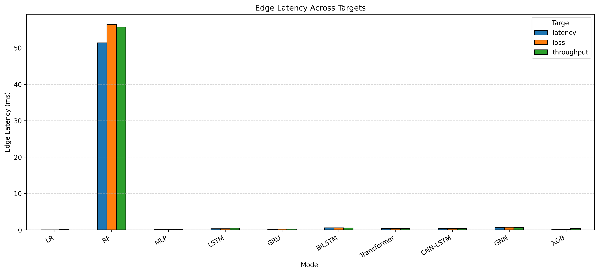

**Use this slide to explain:**  
Edge latency differs strongly by model. Some accurate models may be slower, so target accuracy must be interpreted together with deployment cost.

---

# Multi-Target Plot: Computational Latency

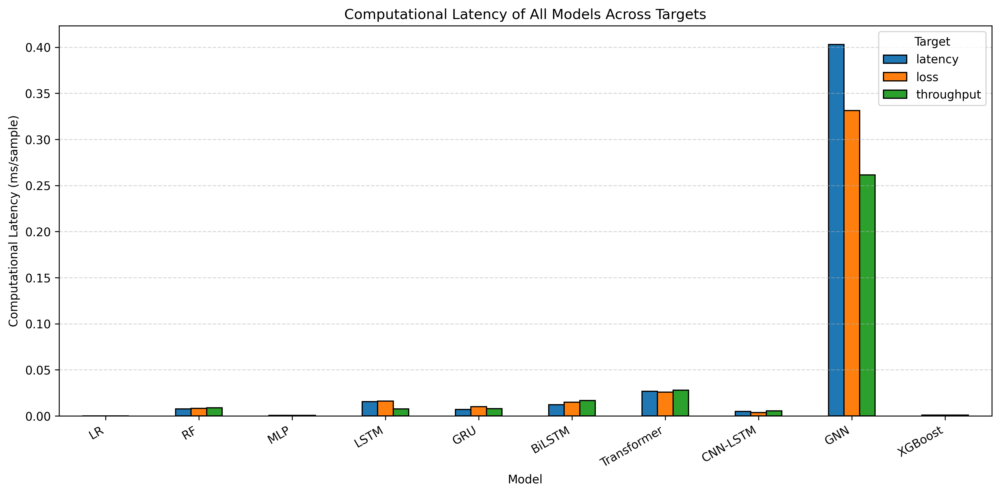

**Use this slide to explain:**  
Computational evaluation reports per-sample latency from repeated-batch inference. This gives a stable comparison of pure inference cost.

---

# Multi-Target Plot: Accuracy-Efficiency

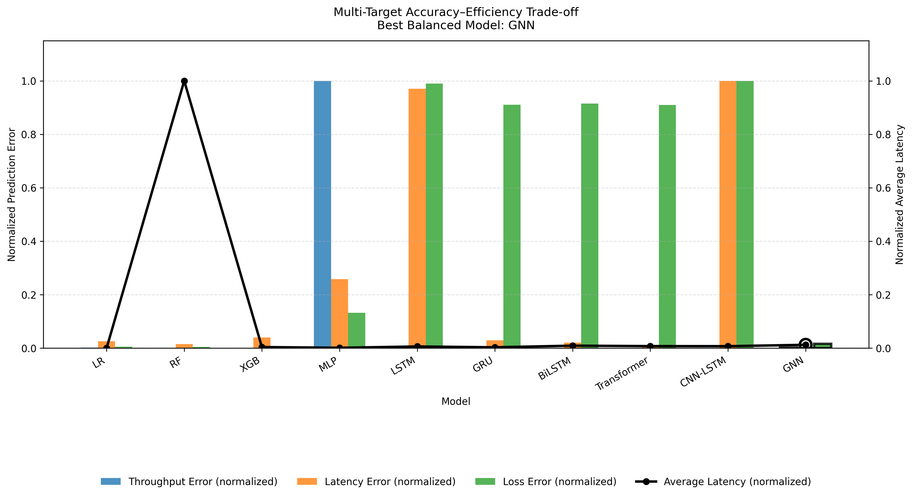

**Use this slide to explain:**  
The normalized view compares prediction error and latency on the same scale. It supports choosing a model by tradeoff rather than accuracy alone.

---

# Multi-Target Plot: RMSE Comparison

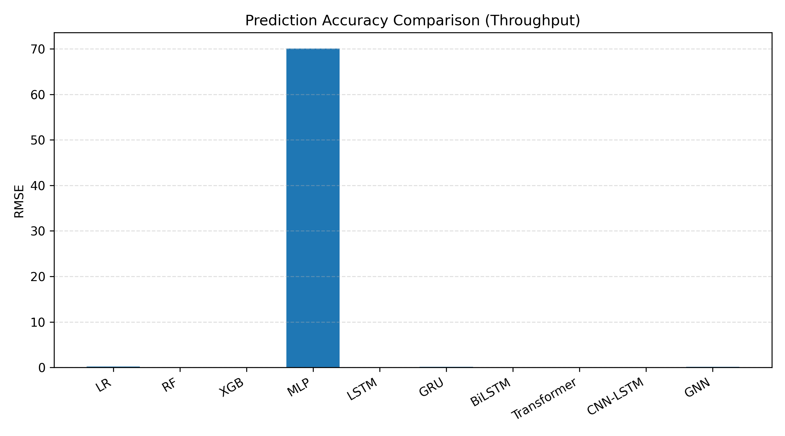

**Use this slide to explain:**  
RMSE shows prediction quality across models and targets. It should be read together with latency and model size before making deployment decisions.

---

# How To Answer: "Which Model Is Best?"

Best model depends on the objective:

- best accuracy: choose lowest validation/test error
- best edge model: choose low latency, low size, low energy
- best interpretability: Linear Regression or tree feature importance
- best relational modeling: GNN
- best sequence modeling: LSTM, GRU, BiLSTM, CNN-LSTM, Transformer

**Strong answer:**  
There is no single best model for all criteria. The thesis compares accuracy and deployment feasibility together.

---

# Likely Committee Question 1

**Question:** Why did you train separate models for throughput, latency, and loss?

**Answer:**

- The three targets have different physical meanings.
- They have different numerical scales.
- Their relationship with input features may be different.
- Separate models avoid one target dominating the training loss.

**Extra point:**  
A future extension could use multi-task learning with one shared model and three output heads.

---

# Likely Committee Question 2

**Question:** Why use sequence models if the sequence length is 1?

**Answer:**

- The architecture is prepared for sequence-based prediction.
- Current preprocessing reshapes each row into a one-step sequence.
- Therefore, these models are evaluated as sequence-capable architectures under the current dataset format.
- Their temporal advantage is limited unless longer sliding windows are used.

**Honest limitation:**  
For stronger temporal claims, the dataset should be converted into true multi-step windows.

---

# Likely Committee Question 3

**Question:** Is CNN-LSTM really using convolution meaningfully?

**Answer:**

- Yes, the model contains a real `Conv1d` layer.
- It maps 73 input channels to 64 learned channels.
- The convolution is applied along the sequence axis.
- However, with sequence length 1, the temporal kernel has limited context.

**Conclusion:**  
The layer is architecturally correct, but more meaningful temporal convolution requires longer sequences.

---

# Likely Committee Question 4

**Question:** What is the difference between CNN convolution and GNN convolution?

**Answer:**

- CNN convolution scans a regular grid or ordered sequence.
- GNN convolution aggregates information from graph neighbors.
- CNN locality is based on nearby timesteps.
- GNN locality is based on edges between station nodes.

**In this thesis:**  
CNN-LSTM uses temporal convolution. GNN uses station-to-station graph convolution.

---

# Likely Committee Question 5

**Question:** Why is GNN appropriate for WiFi stations?

**Answer:**

- Stations are not independent.
- They share medium access and interfere through contention.
- Per-station RSSI, SNR, and BER describe node-level link quality.
- A graph lets the model learn interactions among stations.

**Defense point:**  
GNN matches the relational nature of wireless networks better than purely flat tabular models.

---

# Likely Committee Question 6

**Question:** Why compare deep learning models with tree models?

**Answer:**

- WiFi prediction from engineered features is a tabular regression problem.
- Tree models are strong baselines for tabular data.
- Deep models test whether sequence, attention, or graph structure improves prediction.
- The comparison shows whether added complexity is justified.

**Strong point:**  
Without tree baselines, deep learning results may look better than they really are.

---

# Likely Committee Question 7

**Question:** What does validation loss control during training?

**Answer:**

- Training loss measures fit on training data.
- Validation loss estimates generalization to unseen samples.
- Early stopping stops training when validation loss no longer improves.
- This reduces overfitting.

**In the notebooks:**  
Neural models save the best state based on validation performance.

---

# Likely Committee Question 8

**Question:** What are the main threats to validity?

**Answer:**

- Simulation data may not capture every real-world WiFi condition.
- Sequence length is short for temporal models.
- Graph construction is simplified as fully connected.
- Hyperparameters may not be globally optimal.
- Results depend on feature quality and train/test split design.

**Defense point:**  
These are acknowledged limitations and motivate future extensions with real traces and longer temporal windows.

---

# Likely Committee Question 9

**Question:** Why not use one model with three outputs?

**Answer:**

- A three-output model is possible.
- Separate models make per-target comparison clearer.
- Each target can converge differently.
- It avoids loss balancing problems between throughput, latency, and loss.

**Future work:**  
Use multi-task learning with weighted losses or uncertainty-based loss balancing.

---

# Likely Committee Question 10

**Question:** How would you improve this work next?

**Answer:**

- Build true sliding windows with sequence length greater than 1.
- Add real-world WiFi measurement data.
- Tune hyperparameters systematically.
- Try graph attention networks for adaptive station influence.
- Evaluate model compression for edge deployment.
- Compare centralized prediction with on-device inference.

---

# Main Takeaway

The models differ mainly in how they represent relationships:

- **Linear models:** direct feature-to-output relationship
- **Tree models:** rule-based feature splits
- **Dense neural models:** nonlinear feature mixing
- **Recurrent models:** hidden state over sequence steps
- **CNN-LSTM:** local temporal pattern extraction plus recurrence
- **Transformer:** attention over sequence tokens
- **GNN:** station graph message passing

For this dataset, sequence length is currently very short, so tabular and graph structure may matter more than long-term temporal memory.
